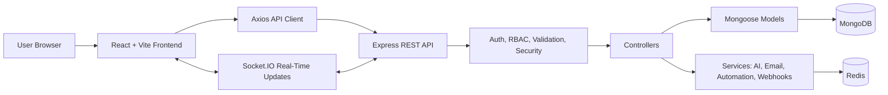
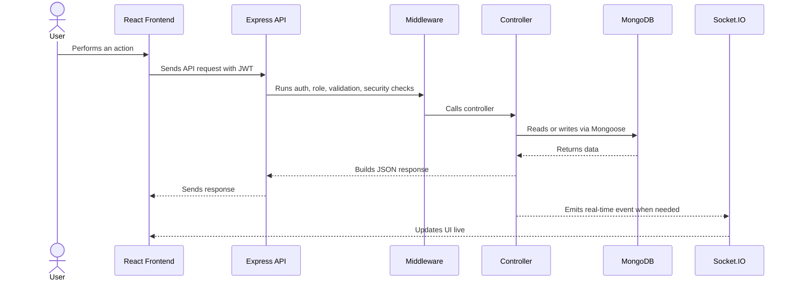
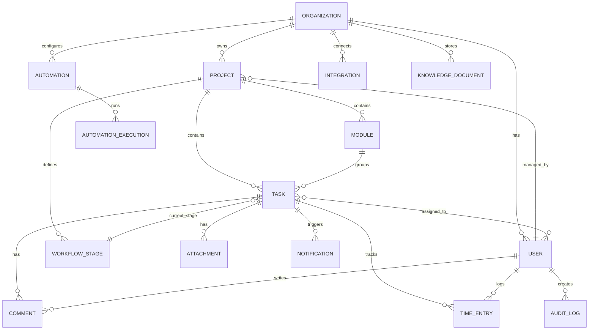
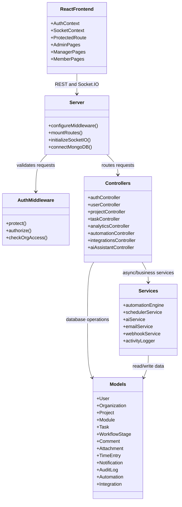

# ProjectFlow

**Project & Workflow Management System**

ProjectFlow is a full-stack project and workflow management system designed for collaborative teams. It enables managers to create projects, assign and track tasks, while team members collaborate and move work through Kanban-based workflows. Role-based access control, real-time updates, notifications, analytics, and project progress tracking support structured team collaboration.

## Features

### Core Functionality
- **Multi-role architecture**: Admin, Manager, and Member access levels.
- **Project management**: Projects, modules, workflow stages, Kanban-style task movement, and progress tracking.
- **Task management**: Task assignment, priorities, due dates, comments, attachments, and status history.
- **Real-time collaboration**: Online status, task updates, and notifications via Socket.IO.

### Modules & Add-ons
- **Time tracking**: Built-in time logger with billable hours and manual entries.
- **Global search**: Search across projects, tasks, and users.
- **Data export**: CSV/XLSX export support for tasks and analytics.
- **Integrations**: API keys, webhook subscriptions, and third-party integration configuration.
- **AI assistant**: AI-assisted project scaffolding, sprint planning, and knowledge-base chat.

### Analytics & Reporting
- **Admin dashboard**: Organization-level metrics and user activity logs.
- **Workload analysis**: Team capacity and task distribution.
- **Bottleneck detection**: Delayed/stalled task and project risk insights.

## Tech Stack

- **Frontend**: React, Vite, React Router, Axios, Styled-Components, Recharts, Lucide Icons.
- **Backend**: Node.js, Express, Mongoose, Socket.IO.
- **Database**: MongoDB.
- **Cache / real-time scaling**: Redis.
- **Security**: JWT, bcrypt, Helmet, CORS, express-rate-limit, express-validator, mongo-sanitize, xss-clean, hpp.
- **Files / exports**: Multer, XLSX, json2csv.
- **AI / services**: AWS Bedrock SDK, Nodemailer, webhook service.
- **DevOps**: Docker, Nginx, Docker Compose.

## Architecture



## Request Flow



## Database Schema

MongoDB is used through Mongoose schemas. The database is document-oriented, with references between organizations, users, projects, modules, tasks, workflow stages, and collaboration records.



### Main Collections

| Collection | Purpose |
|---|---|
| `User` | Users, roles, organization membership, login security, and preferences. |
| `Organization` | Company/team tenant record. |
| `Project` | Project metadata, manager, team members, and workflow stage references. |
| `Module` | Feature or work grouping inside a project. |
| `Task` | Assigned work item with priority, due date, stage, time tracking, and workflow history. |
| `WorkflowStage` | Project-specific stages such as Backlog, To Do, Review, and Done. |
| `Comment` | Task discussions, mentions, and comment attachments. |
| `Attachment` | Uploaded file metadata. |
| `TimeEntry` | Time tracking records for tasks. |
| `Notification` | Assignment, status, deadline, mention, and system notifications. |
| `ActivityLog` / `AuditLog` | User activity and auditable change history. |
| `Automation` / `AutomationExecution` / `AutomationTemplate` | Automation rules, templates, and run history. |
| `Integration` / `Webhook` / `ApiKey` | External integration, webhook, and API access configuration. |
| `Conversation` / `KnowledgeDocument` | AI assistant chat history and knowledge base content. |
| `PasswordReset` | Password reset token and expiry state. |

## Class / Module Diagram

The backend is not traditional OOP-heavy code. Its class equivalents are Mongoose models, Express controllers, middleware, and services.



## Default Roles

- **Admin**: Full access to organization settings, user management, integrations, analytics, automations, and audit logs.
- **Manager**: Can create projects, modules, tasks, manage project teams, and view analytics.
- **Member**: Works mainly with assigned tasks, comments, time tracking, notifications, and the My Work dashboard.

## Installation

### Prerequisites
- Node.js v18+
- MongoDB
- Redis

### 1. Clone & Install
```bash
git clone https://github.com/Jeyasaravanan18/Project-and-Workflow-Management-System.git
cd Project-and-Workflow-Management-System
```

### 2. Backend Setup
```bash
cd backend
npm install
cp .env.example .env
# Update .env with your MongoDB, Redis, JWT, email, and AI credentials.
npm run dev
```

### 3. Frontend Setup
```bash
cd frontend
npm install
npm run dev
```

### 4. Docker Deployment
```bash
docker-compose up --build
```

## Interview Notes

- This is best described as an MVP or advanced academic full-stack project.
- Do not claim it is production-grade unless tenant isolation, tests, secrets management, transactions, monitoring, and CI/CD are fully strengthened.
- MongoDB is defensible because workflow stages, automation rules, integration settings, AI conversations, and metadata are flexible documents.
- The most important concepts to understand are JWT/RBAC, MongoDB relationships, task lifecycle, Socket.IO updates, and security trade-offs.

## License

This project is licensed under the MIT License.
