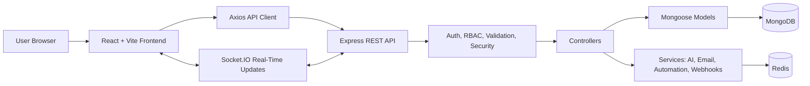
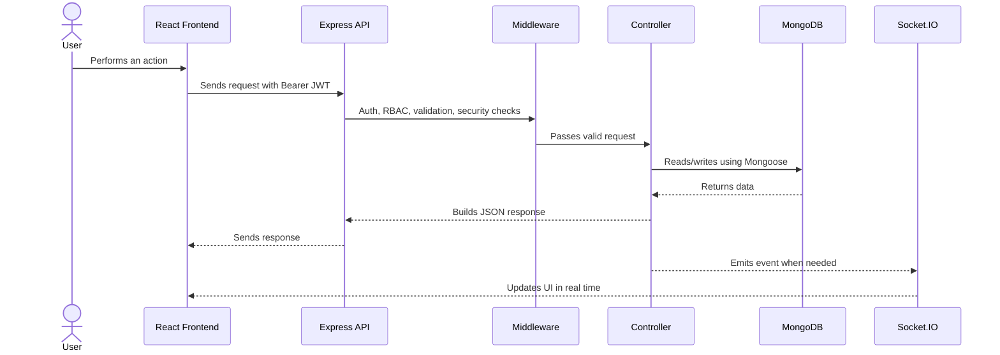
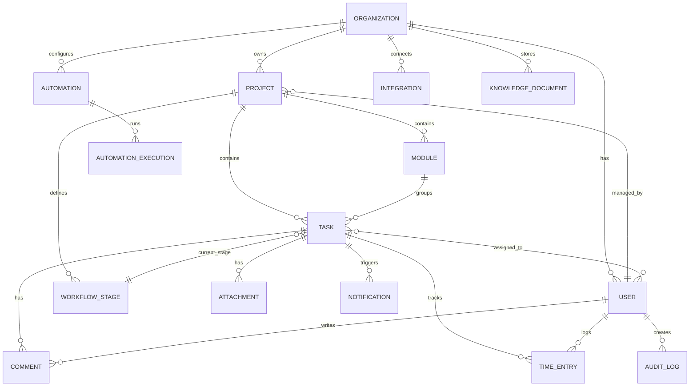
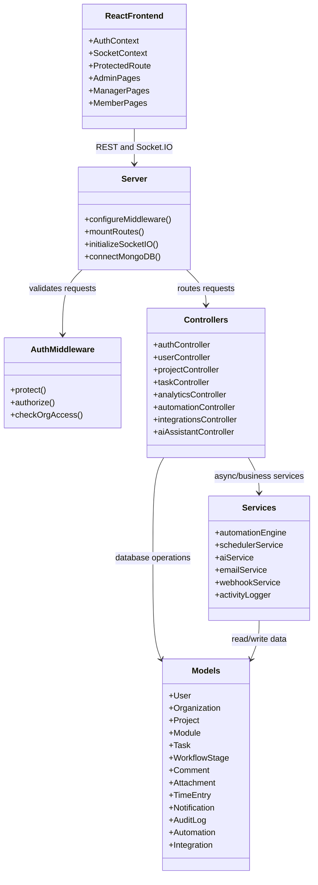

# ProjectFlow

ProjectFlow is a full-stack project and workflow management system for teams that need structured project planning, task tracking, collaboration, analytics, and automation in one place.

The application supports organization-based access, role-specific dashboards, project/module/task management, real-time updates, notifications, file attachments, time tracking, analytics, integrations, webhooks, and AI-assisted planning.

## Contents

- [Features](#features)
- [Tech Stack](#tech-stack)
- [Architecture](#architecture)
- [Database Schema](#database-schema)
- [Class / Module Diagram](#class--module-diagram)
- [Getting Started](#getting-started)
- [Environment Variables](#environment-variables)
- [Available Scripts](#available-scripts)
- [API Overview](#api-overview)
- [Project Structure](#project-structure)
- [Deployment](#deployment)

## Features

### Project and Task Management

- Organization registration and user authentication.
- Role-based access for Admin, Manager, and Member users.
- Project creation with module-based organization.
- Custom workflow stages for each project.
- Task creation, assignment, prioritization, due dates, and status tracking.
- Task comments, attachments, activity history, and time tracking.

### Collaboration

- Real-time task and notification updates using Socket.IO.
- Online user status.
- Assignment and status-change notifications.
- Team and project member management.

### Analytics and Productivity

- Admin dashboard for organization metrics.
- Workload analytics and team capacity views.
- Bottleneck and project-risk analysis.
- Personal performance dashboard.
- CSV/XLSX export support.

### Automation and Integrations

- Automation rules, templates, execution history, and scheduled jobs.
- Webhook subscriptions and signed webhook payloads.
- API key management.
- Third-party integration configuration.

### AI Assistance

- AI assistant backed by a knowledge base.
- AI-generated project scaffolding.
- AI-assisted sprint planning and bottleneck recommendations.

## Tech Stack

| Layer | Technologies |
|---|---|
| Frontend | React, Vite, React Router, Axios, Styled-Components, Recharts, Lucide Icons |
| Backend | Node.js, Express, Mongoose, Socket.IO |
| Database | MongoDB |
| Cache / Scaling | Redis, Socket.IO Redis adapter |
| Authentication | JWT access/refresh tokens, bcrypt |
| Security | Helmet, CORS, express-rate-limit, express-validator, mongo-sanitize, xss-clean, hpp |
| Files / Export | Multer, XLSX, json2csv |
| AI / External Services | AWS Bedrock SDK, Nodemailer, webhooks |
| DevOps | Docker, Docker Compose, Nginx |

## Architecture



## Request Flow



## Database Schema

ProjectFlow uses MongoDB with Mongoose schemas. The data model is document-oriented with references between organizations, users, projects, modules, tasks, workflow stages, and collaboration records.



### Main Collections

| Collection | Purpose |
|---|---|
| `User` | Users, roles, organization membership, login security, and preferences |
| `Organization` | Company/team tenant record |
| `Project` | Project metadata, manager, team members, and workflow stage references |
| `Module` | Feature or work grouping inside a project |
| `Task` | Assigned work item with priority, due date, stage, time tracking, and workflow history |
| `WorkflowStage` | Project-specific stages such as Backlog, To Do, Review, and Done |
| `Comment` | Task discussions, mentions, and comment attachments |
| `Attachment` | Uploaded file metadata |
| `TimeEntry` | Time tracking records for tasks |
| `Notification` | Assignment, status, deadline, mention, and system notifications |
| `ActivityLog` / `AuditLog` | User activity and auditable change history |
| `Automation` / `AutomationExecution` / `AutomationTemplate` | Automation rules, templates, and run history |
| `Integration` / `Webhook` / `ApiKey` | External integration, webhook, and API access configuration |
| `Conversation` / `KnowledgeDocument` | AI assistant chat history and knowledge base content |
| `PasswordReset` | Password reset token and expiry state |

## Class / Module Diagram



## Getting Started

### Prerequisites

- Node.js 18+
- npm
- MongoDB
- Redis

### Clone the Repository

```bash
git clone https://github.com/Jeyasaravanan18/Project-and-Workflow-Management-System.git
cd Project-and-Workflow-Management-System
```

### Backend Setup

```bash
cd backend
npm install
cp .env.example .env
npm run dev
```

The backend runs on `http://localhost:5000` by default.

### Frontend Setup

```bash
cd frontend
npm install
npm run dev
```

The frontend runs on `http://localhost:5173` by default.

## Environment Variables

Create `backend/.env` from `backend/.env.example`.

| Variable | Purpose |
|---|---|
| `NODE_ENV` | Runtime environment |
| `PORT` | Backend server port |
| `MONGODB_URI` | MongoDB connection string |
| `JWT_SECRET` | Access token signing secret |
| `JWT_REFRESH_SECRET` | Refresh token signing secret |
| `REDIS_URL` | Redis connection URL |
| `EMAIL_SERVICE` | Email service provider |
| `EMAIL_FROM` | Sender email address |
| `EMAIL_FROM_NAME` | Sender display name |
| `FRONTEND_URL` | Frontend URL used in email links |
| `ALLOWED_ORIGINS` | CORS allowlist |
| `AWS_ACCESS_KEY_ID` / `AWS_SECRET_ACCESS_KEY` | AWS credentials for AI services when enabled |
| `AWS_REGION` | AWS region |
| `AWS_S3_BUCKET` | Upload bucket name for future/cloud storage support |

## Available Scripts

### Backend

```bash
npm run dev       # Start backend with nodemon
npm start         # Start backend
npm test          # Run Jest tests
npm run test:watch
```

### Frontend

```bash
npm run dev       # Start Vite dev server
npm run build     # Build production frontend
npm run preview   # Preview production build
npm run lint      # Run ESLint
```

## API Overview

| Area | Base Route |
|---|---|
| Auth | `/api/auth` |
| Password | `/api/password` |
| Users | `/api/users` |
| Projects | `/api/projects` |
| Modules | `/api/modules` |
| Tasks | `/api/tasks` |
| Comments | `/api/tasks/:taskId/comments` |
| Attachments | `/api/attachments` |
| Time Tracking | `/api/time` |
| Search | `/api/search` |
| Analytics | `/api/analytics` |
| Notifications | `/api/notifications` |
| Activities | `/api/activities` |
| Automations | `/api/automations` |
| AI Assistant | `/api/ai-assistant` |
| Integrations | `/api/integrations` |
| Webhooks | `/api/webhooks` |
| API Keys | `/api/keys` |
| Sprint Planner | `/api/sprint-planner` |

Swagger UI is available at:

```text
http://localhost:5000/api-docs
```

Health check:

```text
GET http://localhost:5000/health
```

## Project Structure

```text
.
├── backend/
│   ├── config/
│   ├── controllers/
│   ├── middleware/
│   ├── models/
│   ├── routes/
│   ├── services/
│   ├── templates/
│   ├── tests/
│   ├── utils/
│   └── server.js
├── frontend/
│   ├── src/
│   │   ├── components/
│   │   ├── context/
│   │   ├── hooks/
│   │   ├── pages/
│   │   ├── services/
│   │   └── utils/
│   ├── Dockerfile
│   └── nginx.conf
├── docs/
├── docker-compose.yml
└── README.md
```

## Deployment

Run the full stack with Docker Compose:

```bash
docker-compose up --build
```

Services:

- Frontend: `http://localhost`
- Backend: `http://localhost:5000`
- MongoDB: `localhost:27017`
- Redis: `localhost:6379`

## Security Notes

- Passwords are hashed with bcrypt before storage.
- Protected API routes use JWT Bearer authentication.
- Role checks are enforced through backend middleware.
- Request validation uses express-validator.
- Common HTTP security protections are configured through Helmet, CORS, rate limiting, NoSQL sanitization, XSS cleanup, and HPP protection.

## License

This project is licensed under the MIT License.
