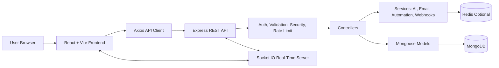
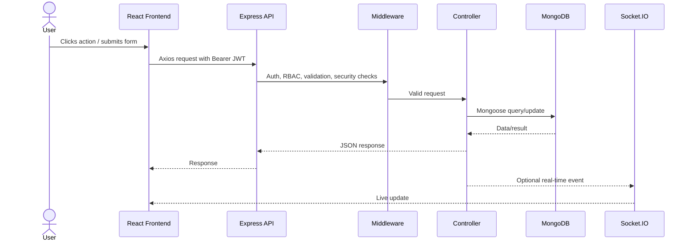
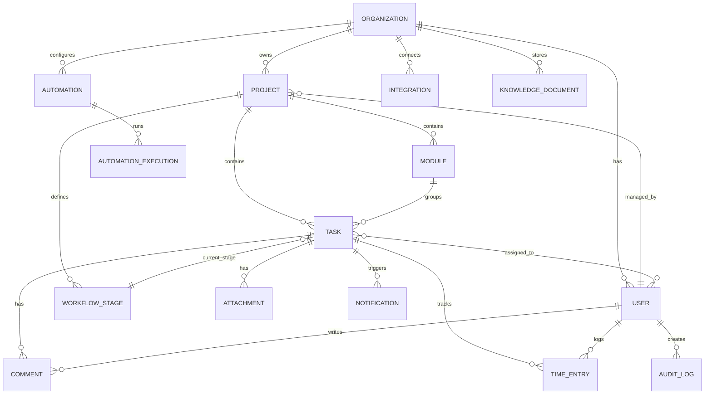
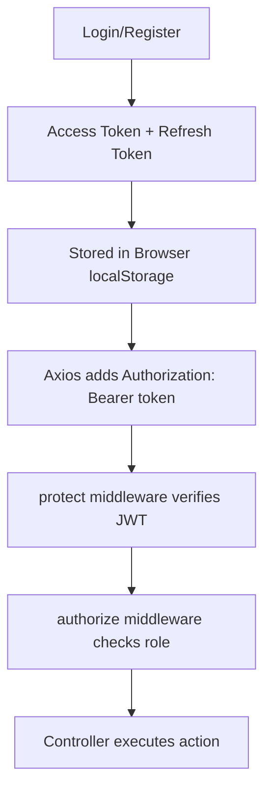

# ProjectFlow - Brief Project Documentation

Repository analyzed: `Jeyasaravanan18/Project-and-Workflow-Management-System`  
Local codebase: `C:\Users\rsury\.gemini\antigravity\playground\enterprise-workflow`  
Status: MVP / advanced academic project, not production-grade.

## 1. Project Overview

ProjectFlow is a MERN-based project and workflow management system for organizations. It helps admins, managers, and team members manage projects, modules, tasks, workflow stages, comments, attachments, time tracking, notifications, analytics, automations, integrations, and AI-assisted planning.

Target users:
- Admin: manages organization users, integrations, analytics, automations, and audit logs.
- Manager: creates projects, modules, tasks, assigns work, tracks project progress.
- Member: views assigned tasks, updates status, tracks time, comments, and receives notifications.

30-second interview explanation:

> ProjectFlow is a full-stack project and workflow management platform built with React, Express, MongoDB, and Node.js. It supports role-based access for admins, managers, and members, with project/task management, workflow stages, real-time Socket.IO updates, analytics dashboards, time tracking, notifications, automations, integrations, and AI-assisted project scaffolding.

## 2. High-Level Architecture

Architecture type:
- Client-server monolith.
- REST API backend.
- MVC/layered backend structure.
- Event-driven parts for automation and real-time updates.
- MongoDB document database with references.

## 3. Repository Structure

| Path | Purpose |
|---|---|
| `frontend/` | React/Vite frontend application |
| `frontend/src/pages/` | Role-based dashboard and feature pages |
| `frontend/src/components/` | Reusable UI components |
| `frontend/src/context/` | Auth, theme, and socket state |
| `frontend/src/services/api.js` | Axios client and JWT interceptor |
| `backend/server.js` | Express app, middleware, routes, MongoDB, Redis, Socket.IO |
| `backend/routes/` | API route definitions |
| `backend/controllers/` | Request handling and business logic |
| `backend/models/` | Mongoose database schemas |
| `backend/middleware/` | Auth, RBAC, validation, rate limiting, security, upload handling |
| `backend/services/` | AI, email, automation, scheduler, webhooks, realtime integration |
| `backend/utils/` | JWT, logging, pagination, custom errors |
| `backend/tests/` | Backend tests; currently only health check |
| `docker-compose.yml` | Frontend, backend, MongoDB, and Redis containers |
| `docs/` | Existing diagrams/documentation |

## 4. Request Flow

## 5. Main Features

- Organization registration and login.
- JWT authentication and role-based access.
- User invitation and role management.
- Project, module, and task management.
- Custom workflow stages.
- Task assignment, comments, attachments, and time tracking.
- My Work dashboard for members.
- Admin/manager analytics dashboards.
- Activity and audit logging.
- Real-time online status and task/notification updates.
- Automations and automation templates.
- Webhooks and third-party integration configuration.
- AI assistant, sprint planning, and project scaffolding.

## 6. Database Design

Database: MongoDB with Mongoose ODM.  
Database name visible from env example: `projectflow`.

Important collections:

| Collection | Purpose |
|---|---|
| `User` | Auth users, roles, organization membership, preferences, lockout |
| `Organization` | Tenant/organization record |
| `Project` | Project metadata, manager, team, workflow stages |
| `Module` | Project module or feature grouping |
| `Task` | Assigned work item with priority, due date, stage, time, history |
| `WorkflowStage` | Custom Kanban/workflow stages per project |
| `Comment` | Task comments and mentions |
| `Attachment` | Uploaded file metadata |
| `TimeEntry` | Time tracking entries |
| `Notification` | User notifications with TTL cleanup |
| `ActivityLog` / `AuditLog` | Activity and audit history |
| `Automation` / `AutomationExecution` / `AutomationTemplate` | Automation rules and run history |
| `Integration` | Third-party integration configuration |
| `ApiKey` / `Webhook` | External API and webhook support |
| `Conversation` / `KnowledgeDocument` | AI assistant history and knowledge base |
| `PasswordReset` | Password reset token records |

## 7. API Summary

| Area | Important Endpoints |
|---|---|
| Auth | `POST /api/auth/register`, `POST /api/auth/login`, `POST /api/auth/refresh`, `POST /api/auth/logout`, `GET /api/auth/me` |
| Users | `GET /api/users`, `POST /api/users/invite`, `POST /api/users/bulk-invite`, `PATCH /api/users/:id/role`, `PATCH /api/users/:id/status` |
| Projects | `GET /api/projects`, `POST /api/projects`, `GET /api/projects/:id`, `GET /api/projects/:id/dashboard`, `POST /api/projects/:id/scaffold` |
| Tasks | `GET /api/tasks`, `POST /api/tasks`, `GET /api/tasks/my-work`, `GET /api/tasks/:id`, `PATCH /api/tasks/:id/status`, `POST /api/tasks/:id/timer` |
| Modules | `GET /api/modules`, `POST /api/modules`, `GET /api/modules/:id`, `GET /api/modules/:id/analytics` |
| Collaboration | comments, attachments, notifications, activity logs |
| Admin/Analytics | analytics, audit export, workload, bottlenecks |
| Automation | automations, templates, executions, test/toggle |
| Integrations | catalog, connected integrations, connect/test/disconnect |
| AI | chat, conversations, documents, sprint/project generation |

## 8. Authentication and Authorization

Verified security features:
- Passwords are hashed with bcrypt.
- Access and refresh JWTs are used.
- Role-based authorization exists for admin/manager/member routes.
- Rate limiting exists for auth/API/password reset/user creation.
- Helmet, CORS, NoSQL sanitization, XSS cleanup, and HPP prevention are configured.

Important limitation:
- JWTs are stored in `localStorage`, which is vulnerable if XSS occurs. A production system should prefer secure httpOnly cookies or very strong frontend XSS controls.

## 9. Security Review

| Risk | Severity | Evidence / Reason | Fix |
|---|---:|---|---|
| Cross-tenant task exposure | Critical | `getTasks` does not enforce `organizationId` filtering | Always filter by `req.user.organizationId`; make task `organizationId` required |
| Task creation missing organizationId | High | task creation derives project/module but does not persist org id | Set `organizationId` from authenticated user's organization or project |
| Admin bypass in org check | High | `checkOrgAccess` bypasses org check for `admin` | Treat admin as organization admin; only superadmin should bypass |
| Integration secrets stored in DB config | High | `Integration.config` stores API keys/tokens | Encrypt secrets or use a secrets manager |
| No transactions for multi-step writes | High | project create + stages, AI scaffold modules + tasks | Use MongoDB sessions/transactions |
| Weak tests | High | Only health endpoint test verified | Add controller, auth, validation, and integration tests |
| Debug logging | Medium | Multiple `console.log` debug statements | Replace with structured logger and remove sensitive logs |
| Docker env mismatch | Medium | compose uses `MONGO_URI`; server reads `MONGODB_URI` | Rename compose variable to `MONGODB_URI` |
| Local file uploads | Medium | Multer local disk storage | Add stronger validation, scanning, private storage, signed download URLs |

CSRF: low risk in current Bearer-token design. If auth moves to cookies, add CSRF tokens and SameSite cookies.  
CORS: allowlist-based; production should use exact deployed frontend origins.  
SQL injection: not directly applicable because MongoDB is used.  
NoSQL injection: relevant; partially mitigated by `express-mongo-sanitize` and validators.

## 10. Production Readiness

Production Readiness: 5/10.

Good signs:
- Real authentication and RBAC.
- Security middleware is present.
- MongoDB indexes exist on key models.
- Docker/Nginx setup exists.
- Logging and audit/activity models exist.
- Real-time architecture exists.

Not production-grade yet:
- Incomplete tenant isolation.
- Minimal automated tests.
- No CI/CD verified from code.
- No monitoring/alerting verified from code.
- Secrets management is weak.
- Transactions are missing for multi-step writes.
- Some controllers return inconsistent response formats.
- Some integrations appear simulated or partially implemented.

Top 5 improvements:
1. Fix organization-level data isolation everywhere.
2. Add comprehensive backend tests for auth, RBAC, projects, tasks, analytics, and security.
3. Add MongoDB transactions for multi-document operations.
4. Encrypt integration/API secrets and improve token storage strategy.
5. Add CI/CD, monitoring, environment separation, and production deployment hardening.

## 11. MongoDB vs MySQL

MongoDB is technically easier to defend for this project because the app has flexible workflow stages, automation configs, AI conversations, integration configs, activity metadata, and nested task history. These fit document-style schemas well.

MySQL would be better if the project needed strict relational guarantees, complex reporting joins, stronger constraints, and transactional consistency across many related tables.

Placement interview answer:

> I chose MongoDB because workflow stages, automation rules, integration settings, AI conversations, and metadata can evolve without frequent schema migrations. If the system required strict relational reporting and stronger constraints, MySQL would also be a good choice, but MongoDB fits the current flexible workflow design.

## 12. Resume and Interview Positioning

Resume verdict: Positive.

Safe resume bullet:

> Built a MERN project and workflow management system with JWT-based RBAC, MongoDB task/project schemas, real-time Socket.IO updates, analytics dashboards, time tracking, notifications, and automation/integration modules.

Do not claim:
- Production-grade system.
- Enterprise-ready security.
- Complete test coverage.
- Fully scalable multi-tenant SaaS.
- Fully secure third-party integrations.

## 13. Likely Interview Questions

1. Why did you choose MERN?
2. Why MongoDB instead of MySQL?
3. Explain your project architecture.
4. Explain the request flow from frontend to database.
5. How does JWT authentication work?
6. What is the difference between authentication and authorization?
7. How are admin, manager, and member roles handled?
8. How are projects, modules, tasks, and workflow stages related?
9. How do real-time updates work?
10. What happens if Redis is unavailable?
11. How do you prevent NoSQL injection?
12. Is CSRF a risk in your project?
13. How is CORS configured?
14. What is the biggest security weakness?
15. How would you fix tenant isolation?
16. Where would you use transactions?
17. How would you improve testing?
18. How does time tracking work?
19. How do automations work?
20. What would you improve before production?

## 14. Final Cheat Sheet

| Topic | Answer |
|---|---|
| Project | ProjectFlow |
| Problem solved | Team project, task, workflow, and productivity management |
| Architecture | MERN client-server monolith with REST and Socket.IO |
| Frontend | React, Vite, React Router, Axios |
| Backend | Node.js, Express, Mongoose |
| Database | MongoDB |
| Auth | JWT access/refresh tokens, bcrypt password hashing |
| Roles | Admin, manager, member |
| Main modules | users, projects, modules, tasks, workflow stages, analytics, automations, integrations, AI |
| CSRF | Low risk with Bearer tokens; add CSRF if using cookies |
| CORS | Allowlist-based |
| Injection | SQL not applicable; NoSQL partially mitigated |
| Biggest strength | Broad full-stack feature coverage |
| Biggest red flag | Tenant isolation gaps around task access |
| Production readiness | 5/10 |
| Resume verdict | Positive, but describe as MVP/academic full-stack project |

## 15. Must Understand Before Interview

1. JWT login, refresh, logout, and role-based authorization.
2. MongoDB relationships between organization, users, projects, modules, tasks, and workflow stages.
3. Full task lifecycle: create, assign, update stage, comment, notify, track time.
4. Security concepts: CSRF, CORS, NoSQL injection, XSS, RBAC, tenant isolation.
5. Honest limitations: weak tests, missing transactions, localStorage token risk, incomplete production hardening.
